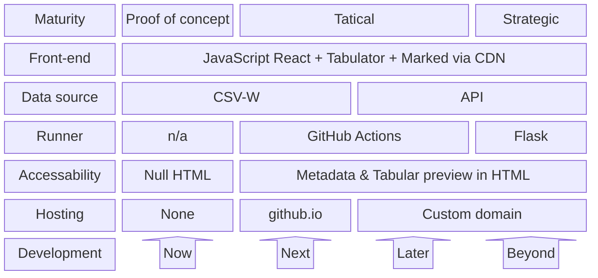

# Theia is a CSV-W visualiser

Theia is a CSV-W visualiser that allows you to visualise CSV-W files in a tabular format. Theia is a web application that is built atop Tabulator's open-source library and simple JavaScript to look up key-value pairs to return the data's metadata in a human-friendly way.

Currently, Theia's pages are fully dynamic besides a single static variable pointing to the CSV-W's JSON file. This means that the HTML page is entirely blank with JavaScript. This is temporary, as the metadata and data preview could be generated as part of a simple GitHub action to create a static page which end-users without JavaScript can view.

## How to use Theia

To use Theia, you need to have a CSV-W file built using [csvcubed](gss-cogs.github.io/csvcubed). The CSV-W file should be hosted on a server, and the URL of its JSON file should be provided to Theia using the JavaScript variable `METADATA_JSON`. Theia will then fetch the CSV-W file and display the data in a tabular format in addition to its metadata.

## Architecture

Theia primarily depends on Tabulator, a JavaScript library that allows you to create tables. Theia passes the CSV file location to Tabulator, which then fetches the data and displays it in a table. Theia also fetches the metadata from the CSV-W file and displays it in a human-readable format.

## Future work

Theia is currently a proof of concept, and there are many improvements that can be made to it. Some of the improvements that can be made are:

- **Static page generation**: Theia can be improved by generating a static page using GitHub actions or Flask. This will allow users without JavaScript to view a preview of the tabular data and metadata.
- **Improved metadata display**: Theia can be improved by displaying the metadata in a more human-readable format (e.g. not using URLs for the pulisher).
- **Improved tabular data display**: Theia can be made more CSV-W aware by suppressing the display of columns which are part of the CSV but excluded in the CSV-W.
- **Click to view data**: Theia can be improved by allowing users to manipulate the data in the table (e.g. sort, filter, etc.) by optionally loading the entire dataset instead of just the first 10 rows as a preview.
- **Improved styling**: Theia can be improved by adding more styling and adopting a design system appriopriate for the publisher of the CSV-W.
- **Data visualisation**: Theia can be improved by adding data visualisation capabilities to the tabular data (e.g. charts, graphs, etc.).

### Feature and development roadmap

## Acknowledgements

Thanks to [Rhys](https://github.com/StRhys) for the glow up and style.

## License

Theia is licensed under the MIT License. See [LICENSE](LICENSE) for more information.

